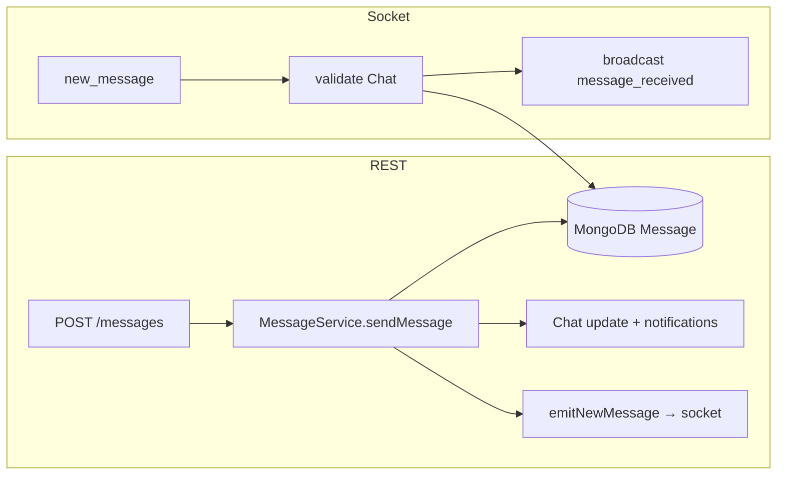
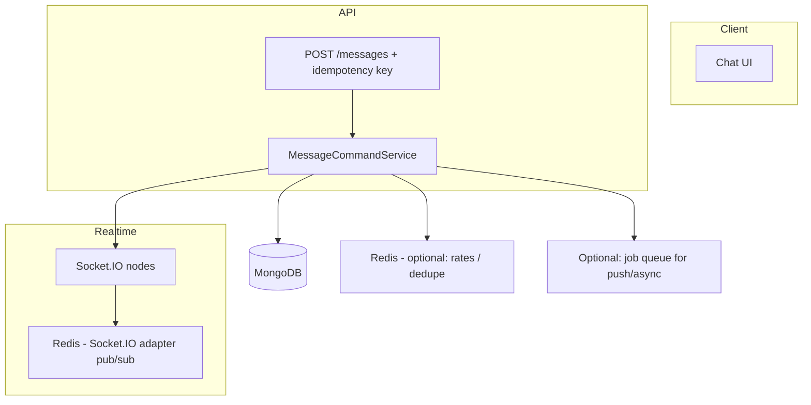
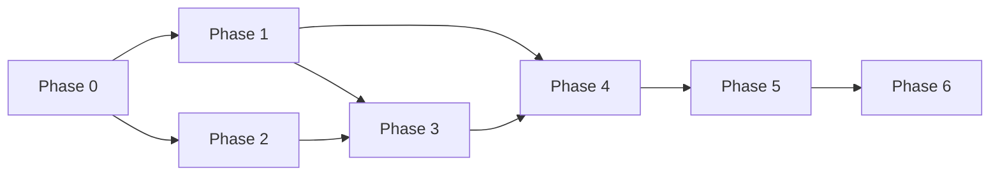

# Chat system: production readiness plan

This document maps the **vibgyorNode** chat flow (social + dating, REST + Socket.IO) and defines how to make it **fast**, **reliable**, **consistent**, and **production ready**.

**Redis is the recommended backbone for realtime scale and cross-process coordination** (Socket.IO clustering, optional rate limits and idempotency). Use it from day one if you run more than one Node instance, or plan to soon.

**Execution order:** follow **[§10 Phased implementation roadmap](#10-phased-implementation-roadmap)**. **§11–§12** summarize what is implemented and production toggles.

---

## 1. Current architecture (as implemented)

### 1.1 Entry points

| Layer | Social | Dating |
|--------|--------|--------|
| **REST** | `POST /api/v1/user/messages` → `enhancedMessageController` → `MessageService.sendMessage` | `DatingMessageService.sendMessage` (dating routes under `/user/dating/messages`) |
| **Socket.IO** | Events in `src/services/enhancedRealtimeService.js`: `join_chat`, `leave_chat`, `new_message`, `typing_start` / `typing_stop`, notifications | `join_dating_chat`, `new_dating_message`, `typing_start_dating` / `typing_stop_dating` |
| **Realtime helper** | `enhancedRealtimeService.emitNewMessage(chatId, payload)` | `emitDatingMessage` |

### 1.2 Social message persistence (two writers)



- **REST** path encrypts text at rest, uploads media to S3, updates `Chat`, creates notifications, then emits over Socket.IO.
- **Socket** path creates a `Message` document and updates `Chat` inside the socket handler, then broadcasts.

**Risk:** two code paths must stay identical (validation, encryption, side effects). Today they are **not** fully aligned (see §3).

### 1.3 Rooms and delivery

- Per-user: `user:{userId}` — notifications, delivered status to sender, etc.
- Per chat: `chat:{chatId}` — social live messages and typing (for members who joined the room).
- Dating: `dating-chat:{chatId}`.

Clients must **`join_chat` / `join_dating_chat`** after connect/reconnect to receive live events for that conversation.

### 1.4 Related modules

- Models: `user/social/userModel/messageModel.js`, `chatModel.js`; dating equivalents.
- Notifications: `notification/services/*`, `deliveryManager.js` (push/in-app paths).
- App bootstrap: `app.js` — HTTP server + `enhancedRealtimeService.init(server)`.

---

## 2. What “good” looks like

| Goal | Meaning |
|------|--------|
| **Fast** | Low latency for send/ack/list; bounded DB and fan-out work; no unnecessary full scans. |
| **Reliable** | Messages survive network blips; retries are safe; multi-instance deployments work. |
| **Consistent** | One definition of “a sent message”; same encryption, validation, and side effects everywhere. |
| **Production ready** | Security, limits, observability, scaling, and operable failure modes. |

---

## 3. Known gaps (from code review)

### 3.1 Consistency — encryption and business rules

- **REST** (`MessageService`) encrypts text content before save.
- **Socket** (`new_message`) saves `content` without going through the same encryption helper → **at-rest format can differ** from REST-created messages and from `docs/ENCRYPTION.md` expectations.
- **Dating** socket path (`new_dating_message`) vs `DatingMessageService.sendMessage` has the same class of risk.

**Recommendation:** Introduce a single internal API, e.g. `createSocialMessage({ ... })` / `createDatingMessage({ ... })`, called from **both** HTTP and Socket handlers. No duplicate persistence logic.

### 3.2 Consistency — idempotency

- Socket duplicate suppression uses “same `chatId`, `senderId`, `content`, within 5 seconds” — weak for media, retries, and concurrent tabs.
- **Recommendation:** Client-generated **`clientMessageId`** (UUID), unique compound index `(chatId, clientMessageId)`, server returns existing row on replay.

### 3.3 Correctness bugs

- `MessageService` (edit / reaction paths) checks `realtime.to` — `enhancedRealtimeService` exposes **`io`**, not `to`. Realtime updates for those features may **never emit**. Use `realtime.io.to(room).emit(...)`.

### 3.4 Reliability — WebSocket vs REST

- If the client sends **only** via `new_message`, a dropped socket means **no row in MongoDB** — user sees “not sent.”
- If the client sends via **REST**, the message can be **saved** while the peer misses `message_received` until reconnect + **re-join rooms** +/or history fetch.

**Recommendation:** Treat **REST (or queue)** as the authoritative create path; use sockets for **fan-out, typing, presence**. Alternatively, queue outbound socket emits with retry.

### 3.5 Reliability — horizontal scale

- Socket.IO state is **in-memory** (`connectedUsers`, rooms). Multiple Node processes without a **Redis adapter** (or equivalent) → **split-brain**: users on instance A do not receive emits from instance B.

**Recommendation:** Adopt **Redis** with `@socket.io/redis-adapter` + load balancer **sticky sessions** (or documented alternative). See **§4.1 Redis** for full usage.

### 3.6 Reliability — “delivered” semantics

- “Delivered” is emitted on a timer or immediately after broadcast — **not** tied to recipient ack or persistence on the client.
- **Recommendation:** Define states: `accepted` (server persisted) → `delivered` (recipient device ack or join + fetch) → `read` (mark read API). Emit transitions accordingly.

### 3.7 Performance

- **`join_chat`:** DB reads, `markChatAsRead`, loop emitting per-message `message_status_update` (up to 100) — heavy on every join.
- **`ChatService.searchChats`:** loads all matching chats then filters in memory — **does not scale**.
- **`getUserChats` (page 1):** extra diagnostic `countDocuments` — disable in production or guard with env flag.
- **Presence:** `user_online` / `user_offline` broadcast patterns can fan out to **all** connections — costly at scale; prefer contact-based or subscribed rooms.

### 3.8 Security / ops (`app.js` and socket auth)

- CORS effectively allows all origins — tighten for production.
- API rate limits are commented out for testing — re-enable for auth and message endpoints; add per-socket rate limits for `new_message` / typing.
- Socket middleware allows some **expired JWT** paths — review for production (prefer: reject + refresh over HTTPS, then reconnect).

### 3.9 Cleanup / false disconnects

- `cleanupStaleConnections` uses `lastActivity`, which is not updated on every engine ping — risk of **wrong disconnects**. Tie activity to any inbound packet or documented heartbeat.

---

## 4. Target architecture (recommended)



1. **Single write path:** `MessageCommandService.createMessage` (validation, encrypt, chat update, notifications).
2. **Socket:** Either **forbid** `new_message` body persistence and only relay after HTTP success, or make `new_message` a **thin** wrapper that calls the same service (with same idempotency).
3. **Redis** for Socket.IO multi-node fan-out (required when `replicas > 1`; recommended to enable early so behavior matches production).
4. **Explicit client contract:** on reconnect → refresh token → `join_chat` for each open thread → catch-up via REST pagination.

### 4.1 Redis — what to use it for

| Use case | Why | Notes |
|----------|-----|--------|
| **Socket.IO Redis adapter** | Broadcasts `emit` / rooms across all Node processes | Install `@socket.io/redis-adapter`; use **`ioredis`** or **`redis`** (v4) and create **two** clients (pub + sub) per [Socket.IO docs](https://socket.io/docs/v4/redis-adapter/). Wire in `enhancedRealtimeService.init()` after `new Server(...)`. |
| **Sticky sessions (load balancer)** | WebSocket upgrade + long-lived connection affinity | Still recommended with Redis adapter so the same client hits the same origin for the TCP/WebSocket path; Redis handles **cross-node message propagation**. |
| **Idempotency / dedupe cache** | `SET key NX EX ttl` for `clientMessageId` before Mongo write | Fast reject of duplicate sends; TTL 24–72h. Complements unique index on Mongo. |
| **Rate limiting** | Per-IP / per-user / per-socket message and typing limits | e.g. `rate-limit-redis` with Express; socket-side counters in Redis with short TTL. |
| **Typing indicator throttle** | Avoid DB; cap events per user+chat per second | `INCR` + `EXPIRE` key `typing:{chatId}:{userId}` with 1s TTL. |
| **Optional: presence** | Replace or supplement in-memory `connectedUsers` Map | Harder than adapter-only; only if you need global presence across regions/instances. Start with **adapter + sticky** first. |

**Environment (example):**

```env
REDIS_URL=redis://localhost:6379
# or
REDIS_HOST=...
REDIS_PORT=6379
REDIS_PASSWORD=...
```

**Bootstrap sketch (conceptual — implement in `enhancedRealtimeService` or `app.js`):**

```js
const { createAdapter } = require('@socket.io/redis-adapter');
const { createClient } = require('redis');

const pubClient = createClient({ url: process.env.REDIS_URL });
const subClient = pubClient.duplicate();
await Promise.all([pubClient.connect(), subClient.connect()]);
io.adapter(createAdapter(pubClient, subClient));
```

**Operational:** run Redis with persistence suited to your SLA (AOF or RDB); monitor memory, evictions, and latency. If Redis is unavailable, define behavior: fail closed on new instances (do not start Socket.IO without adapter in multi-node) or fail open single-node with alert.

**What Redis does *not* replace:** MongoDB remains the source of truth for messages and chats. Redis is for **coordination, caching, and realtime fan-out**, not primary message storage.

---

## 5. Workstreams

### 5.1 Consistency (P0)

- [ ] Unify social message creation (REST + socket) through one module.
- [ ] Same for dating messages.
- [ ] Add `clientMessageId` + unique index; document client behavior.
- [ ] Fix `realtime.io.to` usage for edit/reaction emits.

### 5.2 Reliability (P0–P1)

- [ ] **Redis:** provision instance; add `@socket.io/redis-adapter` + redis clients; attach adapter in server bootstrap; document `REDIS_URL` and LB sticky sessions.
- [ ] **Redis (optional P1):** idempotency keys (`SET NX EX`) for `clientMessageId`; rate-limit store for REST + socket.
- [ ] Authoritative send via HTTP (or idempotent command queue); document mobile/offline strategy.
- [ ] Batch or aggregate read-receipt socket events on join.
- [ ] Align `lastActivity` / cleanup with real traffic.

### 5.3 Performance (P1)

- [ ] Replace in-memory `searchChats` with MongoDB query/aggregation (or search index).
- [ ] Remove or env-gate diagnostic counts in `getUserChats`.
- [ ] Reduce global presence broadcasts; scope to followers/contacts or explicit subscriptions.
- [ ] Validate indexes — `messageModel` already defines useful compounds; review slow-query logs in staging.

### 5.4 Production hardening (P1–P2)

- [ ] Restrict CORS; enable rate limiting; cap message size and socket payload depth.
- [ ] Structured logging + metrics (send latency, socket errors, Mongo timings, emit failures).
- [ ] Alerts on error rate and notification delivery failures.
- [ ] Load test: N concurrent chats, reconnect storms, multi-instance.

---

## 6. MongoDB indexes (social messages)

`messageModel.js` already includes indexes such as:

- `{ chatId: 1, createdAt: -1 }`
- Read/unread and media-oriented compounds

Implemented in code as a **partial unique** index on `(chatId, senderId, clientMessageId)` so two different senders in the same chat are not blocked:

```js
messageSchema.index(
  { chatId: 1, senderId: 1, clientMessageId: 1 },
  { unique: true, partialFilterExpression: { clientMessageId: { $exists: true, $type: 'string' } } }
);
```

Same pattern on `datingMessageModel`. **Deploy:** ensure MongoDB builds these indexes (restart app or `syncIndexes` if you use it).

---

## 7. Client checklist (coordination)

- Send path: **HTTP first** (or queue with retry), then optimistic UI.
- On **socket `error`**, surface and retry with same `clientMessageId`.
- On **reconnect**: re-emit `join_chat` / `join_dating_chat` for active chats.
- Handle **`token:expired`** / refresh flow before critical sends.

---

## 8. Definition of done (production)

- Single persistence path for messages; encryption identical for REST and socket.
- Idempotent sends; no duplicate rows under retries.
- Multi-instance test passes (two servers, users on different instances still get realtime messages).
- p95 send API latency and socket emit latency measured and within SLO.
- Rate limits, CORS, and auth behavior documented for deployment.
- Runbooks: degraded mode (socket down, API up), DB rollback, **Redis outage** (single-node fallback vs read-only realtime — document chosen policy).

---

## 9. File reference (main touchpoints)

| Concern | Primary files |
|--------|----------------|
| Socket.IO chat | `src/services/enhancedRealtimeService.js` |
| Social REST messages | `src/user/social/services/messageService.js`, `userController/enhancedMessageController.js`, `userRoutes/enhancedMessageRoutes.js` |
| Social REST chats | `src/user/social/services/chatService.js`, `enhancedChatRoutes` / controller |
| Dating messages | `src/user/dating/services/datingMessageService.js`, controllers/routes under `dating/` |
| Notifications | `src/notification/services/deliveryManager.js`, handlers |
| HTTP + socket boot | `src/app.js` |
| **Redis / Socket.IO adapter (to add)** | `src/services/enhancedRealtimeService.js` (after `Server` creation), `package.json` deps |

---

## 10. Phased implementation roadmap

This section orders **all** recommendations from §3–§8 into phases. Durations are indicative (assume one focused backend team; adjust for capacity). Later phases assume earlier **exit criteria** are met.

### 10.1 Phase overview

| Phase | Name | Focus | Typical duration |
|-------|------|--------|------------------|
| **0** | Stabilize | Quick correctness fixes, low risk | 2–5 days |
| **1** | Single write path & idempotency | Consistency (REST = socket), encryption, dedupe | 1–2 weeks |
| **2** | Redis & multi-instance | Socket.IO adapter, LB stickiness, Redis outage policy | 3–7 days |
| **3** | Reliability & semantics | Authoritative HTTP send, delivered/read model, join/cleanup | 1–2 weeks |
| **4** | Performance | Search, list APIs, presence, `join_chat` cost | 1–2 weeks |
| **5** | Security & limits | CORS, rate limits, socket payload caps, JWT policy | 3–7 days |
| **6** | Observability & launch | Metrics, alerts, load tests, runbooks, go-live | 1 week |

**Parallelism:** Phase 0 can ship immediately. Phase 1 and Phase 2 can overlap **after** Phase 0 (Redis wiring does not block extracting a shared `createMessage` if interfaces are clear). Phase 5 can start in parallel with Phase 4 once Phase 1 is in code review.



---

### Phase 0 — Stabilize (quick wins)

**Goal:** Fix known bugs and reduce noise without changing product contracts.

| # | Task | Maps to |
|---|------|---------|
| 0.1 | Fix `MessageService` edit/reaction emits: use `enhancedRealtimeService.io.to(room).emit(...)` instead of `realtime.to` | §3.3 |
| 0.2 | Gate `getUserChats` diagnostic `countDocuments` behind `NODE_ENV !== 'production'` or `DEBUG_CHAT_DIAGNOSTICS` | §3.7 |
| 0.3 | Add **chat membership check** to social `typing_start` / `typing_stop` (mirror dating typing validation) | §3.7 / security |
| 0.4 | Document current client contract: reconnect → `join_chat` / `join_dating_chat` (internal wiki or README link) | §7 |

**Exit criteria:** Edits/reactions propagate over socket in staging; typing cannot be triggered for chats the user is not in; prod logs are not flooded with chat diagnostics.

---

### Phase 1 — Single write path, encryption, idempotency

**Goal:** One authoritative implementation for “create message” (social + dating); identical at-rest encryption and validation for REST and Socket.

| # | Task | Maps to |
|---|------|---------|
| 1.1 | Introduce internal module e.g. `MessageCommandService` / `createSocialMessage` that performs validate → encrypt → save → chat update → notify → `emitNewMessage` | §3.1, §4 |
| 1.2 | Refactor `MessageService.sendMessage` to call that module | §1.2 |
| 1.3 | Change socket `new_message` to call the **same** module (or only relay after HTTP — pick one strategy and document) | §3.1, §3.4 |
| 1.4 | Repeat **1.1–1.3** for dating (`DatingMessageService` + `new_dating_message`) | §3.1 |
| 1.5 | Add optional `clientMessageId` on schema + sparse unique index `(chatId, clientMessageId)`; accept from client on REST/socket | §3.2, §6 |
| 1.6 | On duplicate `clientMessageId`, return **200/201 with existing message** (idempotent), do not double-increment unread | §3.2 |
| 1.7 | Update API validation (`enhancedMessageRoutes`) and client docs for `clientMessageId` | §7 |

**Exit criteria:** Socket-sent and REST-sent text messages are indistinguishable in DB (encryption); replaying the same `clientMessageId` does not create duplicates; integration tests cover REST + socket paths.

**Dependency:** Phase 0 complete (especially 0.1 if you touch `MessageService` heavily).

---

### Phase 2 — Redis & horizontal scale

**Goal:** Multiple Node instances see the same Socket.IO broadcasts; operational story for Redis.

| # | Task | Maps to |
|---|------|---------|
| 2.1 | Provision Redis (dev/staging/prod); document `REDIS_URL` | §4.1 |
| 2.2 | Add deps: `@socket.io/redis-adapter`, `redis` or `ioredis` | §4.1 |
| 2.3 | Connect pub/sub clients in bootstrap; `io.adapter(createAdapter(pub, sub))` in `enhancedRealtimeService.init` when `REDIS_URL` is set | §4.1 |
| 2.4 | Configure load balancer **sticky sessions** for WebSocket path; document for DevOps | §4.1 |
| 2.5 | Run **two instances** in staging; verify user A on node 1 receives realtime from user B on node 2 | §8 |
| 2.6 | **(Optional)** Redis `SET idemp:{userId}:{clientMessageId} NX EX` before write — complements Mongo unique index | §4.1, §5.2 |

**Exit criteria:** Cross-node realtime verified; runbook snippet for Redis restart; single-node dev still works with `REDIS_URL` unset **or** local Redis in docker-compose.

---

### Phase 3 — Reliability & message lifecycle semantics

**Goal:** Sends survive bad sockets; statuses mean something; less chatty join behavior.

| # | Task | Maps to |
|---|------|---------|
| 3.1 | **Client + server:** make **HTTP POST** the authoritative send; deprecate or narrow socket `new_message` to ack-only / legacy with feature flag | §3.4 |
| 3.2 | Define **status model**: server `accepted` → client ack `delivered` → `read` via existing mark-read API; adjust emits accordingly | §3.6 |
| 3.3 | Replace per-message read-receipt loop on `join_chat` with **batched** event (`messageIds[]`) or fewer emits | §3.7 |
| 3.4 | Update `lastActivity` on **any** socket inbound event (or engine ping) to fix `cleanupStaleConnections` false positives | §3.9 |
| 3.5 | Remove or replace `setTimeout(500)` “delivered” hack in `MessageService` with real semantics from 3.2 | §3.6 |

**Exit criteria:** Mobile/web QA: airplane mode toggle + resend does not duplicate; read/delivered match agreed spec; no mass disconnect under idle websocket.

**Dependency:** Phase 1 strongly recommended (idempotency makes HTTP retries safe).

---

### Phase 4 — Performance

**Goal:** Chat list and search stay fast as data grows.

| # | Task | Maps to |
|---|------|---------|
| 4.1 | Replace `ChatService.searchChats` “load all then filter” with MongoDB query/aggregation or search engine | §3.7, §5.3 |
| 4.2 | Slim `join_chat`: defer heavy mark-read to REST or batch DB updates | §3.7 |
| 4.3 | Scope `user_online` / `user_offline` to **contact/follower rooms** or subscriptions (design + implement) | §3.7 |
| 4.4 | Review slow queries in staging; confirm `messageModel` indexes cover hot paths | §5.3 |

**Exit criteria:** p95 for chat list + search under agreed thresholds; load test shows no full-collection scan for search.

---

### Phase 5 — Security & production limits

**Goal:** Safe defaults for public or semi-public deployment.

| # | Task | Maps to |
|---|------|---------|
| 5.1 | Restrict CORS to known app origins in production | §3.8 |
| 5.2 | Re-enable Express rate limits; add **Redis store** for distributed limiters if multi-node | §3.8, §4.1 |
| 5.3 | Socket rate limits: `new_message`, typing (Redis counters + TTL) | §3.8, §4.1 |
| 5.4 | Cap socket payload size / message body depth; align with REST limits | §5.4 |
| 5.5 | Review expired-JWT socket behavior — prefer reject + refresh for production | §3.8 |

**Exit criteria:** Pen-test or basic abuse script does not trivially DOS message endpoints; CORS misconfiguration documented for each env.

---

### Phase 6 — Observability, load test, go-live

**Goal:** Operate and prove the system under stress.

| # | Task | Maps to |
|---|------|---------|
| 6.1 | Structured logs + metrics: send latency, socket errors, Mongo time, Redis adapter health | §5.4, §8 |
| 6.2 | Dashboards + alerts (error rate, Redis down, notification failures) | §5.4 |
| 6.3 | Load test: concurrent chats, reconnect storm, two-instance broadcast | §5.4, §8 |
| 6.4 | Runbooks: socket down (API up), Mongo rollback, **Redis outage** (per §8 policy) | §8 |
| 6.5 | Final **definition of done** checklist sign-off (§8) | §8 |

**Exit criteria:** All §8 bullets satisfied; stakeholders sign off.

---

### 10.2 Gap-to-phase matrix

| Gap (§3) | Primary phase |
|----------|----------------|
| 3.1 Encryption / dual path | **1** |
| 3.2 Idempotency | **1** (+ optional **2** Redis) |
| 3.3 `realtime.to` bug | **0** |
| 3.4 REST vs socket send | **3** (design in **1**) |
| 3.5 Horizontal scale | **2** |
| 3.6 Delivered semantics | **3** |
| 3.7 Performance (join, search, presence, diagnostics) | **0** (diagnostics), **4** (rest) |
| 3.8 Security / CORS / rate limits | **5** |
| 3.9 Cleanup / `lastActivity` | **3** |

---

### 10.3 Optional “minimum viable production” path

If you must ship faster, do **Phase 0 → Phase 1 (1.1–1.4 only) → Phase 2 → Phase 5 (partial: CORS + basic rate limit)** then iterate Phases 3–4–6. You still need **Phase 1 core** before trusting data consistency between REST and socket.

---

---

## 11. Implementation status (backend)

**Done in codebase (aligned with phased roadmap):**

| Phase | Items implemented |
|-------|-------------------|
| **0** | `MessageService` edit/reaction/reaction-remove use `realtime.io.to(...)`; `getUserChats` DB diagnostics only when `DEBUG_CHAT_DIAGNOSTICS=1`; social `typing_start` / `typing_stop` verify `Chat` membership; `socket.onAny` updates `lastActivity` (reduces false stale disconnects). |
| **1** | Social + dating socket `new_message` / `new_dating_message` delegate to `MessageService.sendMessage` / `DatingMessageService.sendMessage` (single persistence + encryption path). Optional `clientMessageId` on schemas with partial unique index `(chatId, senderId, clientMessageId)`; idempotent return + `isIdempotentReplay` on replay (socket skips duplicate `new_message_notification`). REST: `clientMessageId` on social + dating send bodies. |
| **2** | `enhancedRealtimeService.attachRedisAdapterIfConfigured()` — set `REDIS_URL`; called from `server.js` after Mongo connect. `REDIS_REQUIRED=true` fails startup if adapter cannot attach. |
| **3–5** | Batched read receipts (+ `messageId` when exactly one message); socket/REST limits and policies; `searchChats` aggregation; **scoped presence**; **`GET /api/v1/metrics`** when enabled. |

**Scoped presence (no global `user_online` / `user_offline` in production)**

| Env | Behavior |
|-----|----------|
| `NODE_ENV=production` | Presence events go only to **chat partners** (active `Chat` containing both users), capped by `PRESENCE_MAX_CHATS_SCAN` (default **200**). Payload includes `presenceScope: 'chat_partners'`. |
| `USE_SCOPED_PRESENCE=true` | Same in any environment. |
| `USE_LEGACY_GLOBAL_PRESENCE=1` | Restores global fan-out (`presenceScope: 'global'`). |

**Metrics:** `ENABLE_METRICS=true` → `GET /api/v1/metrics` (optional `METRICS_SECRET` + header `X-Metrics-Secret`). Returns `connectedUsers`, `activeCalls`, `scopedPresence`, `uptimeSeconds`, `memory`.

**Optional later:** Redis-backed Express rate limit store; explicit client `message_delivered_ack` for delivery semantics; follower-based presence beyond chat partners.

---

## 12. Roadmap status

Planned backend work from this document is **implemented**. Production checklist: `REDIS_URL`, `CORS_ORIGIN`, `ENABLE_API_RATE_LIMIT`, `ENABLE_METRICS`, presence envs above, `ALLOW_SOCKET_MESSAGE_SEND` if HTTP-only sends. Load-test with k6/Artillery and two Node instances when using Redis.

---

*Generated from a full-repo scan of vibgyorNode chat-related services, routes, and realtime layer. Update this doc when the unified message service or Redis adapter lands.*
